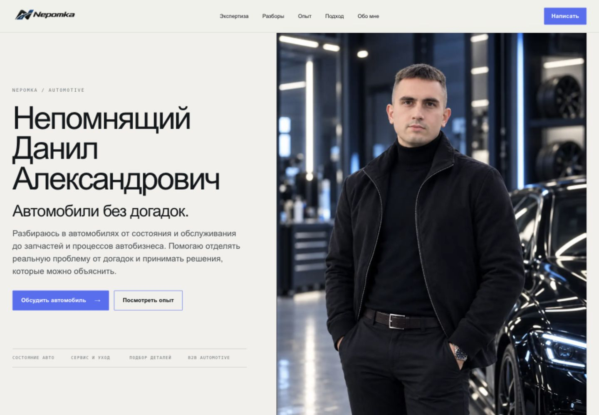
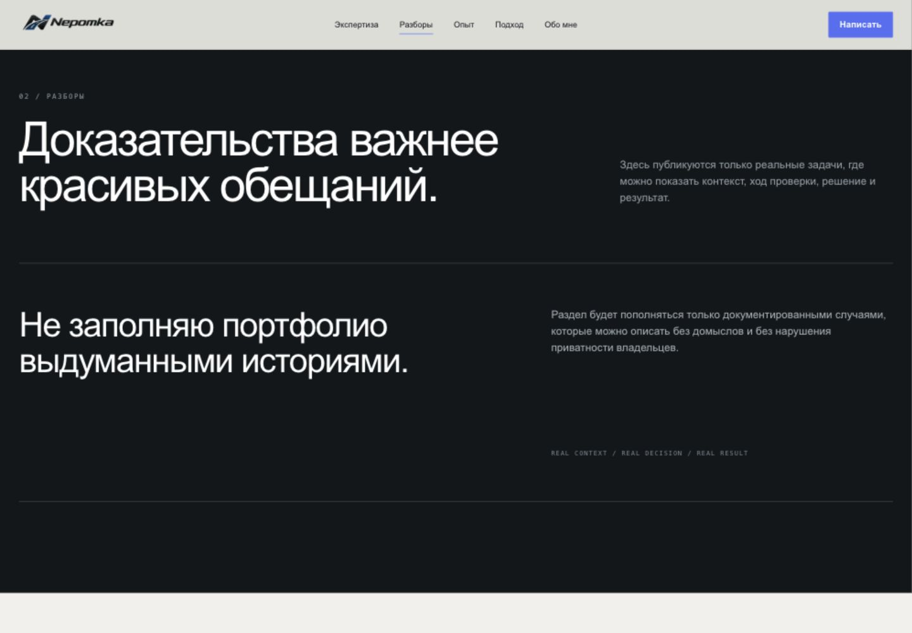
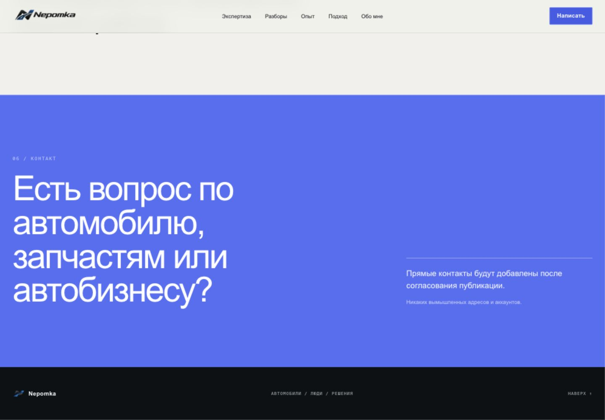
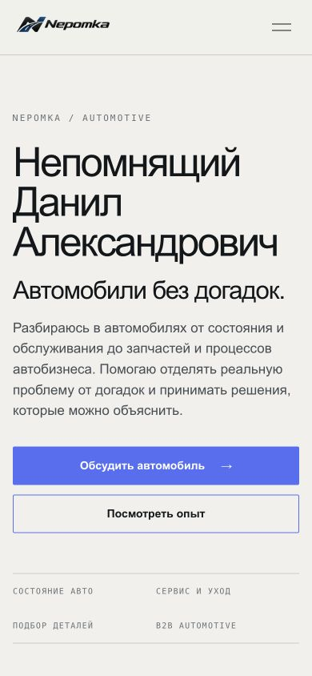
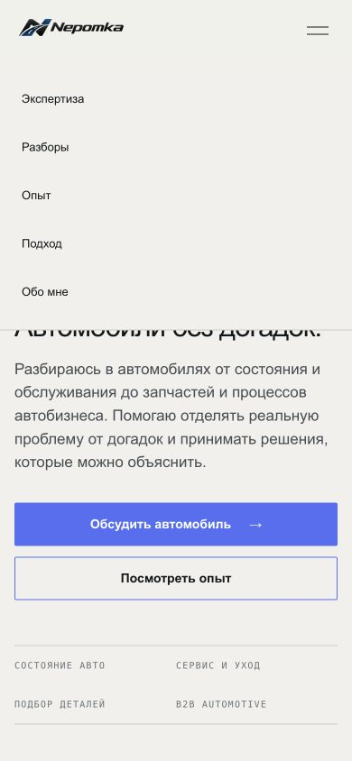
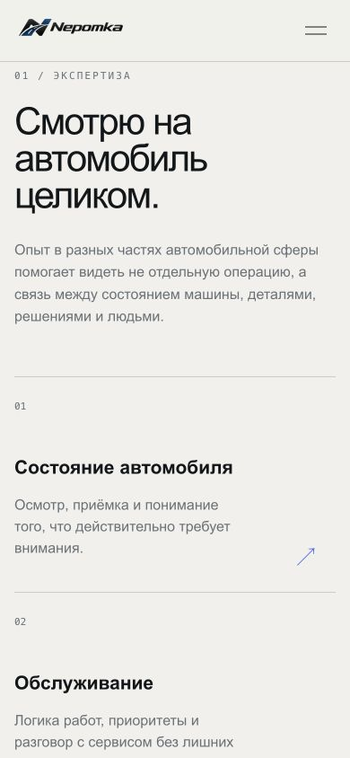

# Nepomka: аудит дизайна, контента и привлечения клиентов

Дата: 6 сентября 2026 года. Проверены https://nepomka.ru/ в браузере, экраны 1440×1000 и 390×844, переходы к разборам и контактам, мобильное меню, DOM и локальные исходники. Это аудит и проект рекомендаций; сайт не изменён и ничего не опубликовано.

## Вывод

У сайта хорошая визуальная основа: сдержанная палитра, крупная типографика, личный портрет, последовательная сетка. Но коммерческий сценарий не завершён: нет контактов, конкретных предложений, условий работы и опубликованных доказательств опыта. Сейчас это имиджевая визитка, по которой трудно принять решение о покупке услуги.

Первое вложение должно идти в предложения, доказательства и связь. Визуальная доработка усиливает их. Рост заявок нельзя обещать без измерений и достаточного трафика.

## Проверенный путь посетителя

1. Первый экран на компьютере — визуально собран, предложение недостаточно конкретно. ФИО занимает три строки и конкурирует с пользой. Не указаны город, формат, стоимость или результат работы.
2. Разборы — переход работает, доказательства отсутствуют. Большая тёмная секция обещает реальные истории, но не показывает ни одной.
3. Обращение — критический тупик. «Написать» ведёт к тексту о будущем согласовании контактов; канала обращения нет. В `src/data/site.ts` все контакты равны `null`.
4. Первый экран на телефоне — текст и обе кнопки помещаются в 390×844, портрет расположен ниже. Полное ФИО и верхний отступ забирают значительную часть экрана. В проверенном состоянии ширина документа равна ширине viewport; это не полная проверка всех разрешений.
5. Мобильное меню — открывается и закрывается после выбора пункта, но не содержит контактов. Кнопка шапки скрыта на узких экранах.
6. Экспертиза на телефоне — читаема, но карточки просторные и описывают области знаний вместо покупаемых услуг. Стрелки выглядят интерактивными; в DOM карточки не являются ссылками.

## Позиционирование

Рабочая гипотеза: главный клиент — автовладелец, которому нужна понятная помощь перед решением о ремонте, обслуживании или запчастях. Проверить с Данилом, какое направление он реально хочет продавать и готов выполнять. На странице сейчас одновременно представлены частные клиенты, детейлинг, приёмка, запчасти и цифровой B2B; их трудно воспринимать как одно конкретное предложение.

Основной образ: спокойный специалист, который помогает разобраться и объясняет выводы. Слоган «Автомобили без догадок» сохранить. B2B вынести в отдельный компактный блок, а отдельную страницу делать после появления подтверждённой услуги и примеров. Если приоритет — B2B, нужна обратная иерархия с бизнес-задачей, заказчиком и измеримым результатом.

Не позиционировать Данила как независимого эксперта, диагноста, оценщика или автоподборщика без подтверждения роли, компетенций и реального состава услуг.

## Предлагаемый первый экран

Ниже редакционный вариант, а не подтверждение того, что перечисленные услуги уже оказываются. Согласовать состав работ до публикации.

**Подпись:** Данил Непомнящий · автомобильный специалист

**Заголовок:** Помогу разобраться с ремонтом и запчастями — до того, как вы потратите деньги.

**Пояснение:** Разберём рекомендации сервиса, варианты деталей и следующие шаги. Вы поймёте, что стоит проверить, какие вопросы задать и как выбрать подходящее решение.

**Основная кнопка:** Обсудить мою ситуацию

**Вторичная кнопка:** Посмотреть разборы — только после появления настоящих разборов.

**Под кнопкой:** Напишите марку, модель и что произошло. Если есть смета или список деталей — приложите их.

Рядом указать подтверждённые город, онлайн/очный формат и способ связи. Не выдумывать срок ответа, бесплатность первого общения, цену или гарантированную экономию. Полное ФИО можно оставить в биографии и структурированных данных; на первом экране достаточно имени и фамилии.

## Упаковка услуг

Вместо «Состояние автомобиля / Обслуживание / Запчасти» показать 3–4 конкретных предложения. Ниже кандидаты для согласования:

| Предложение | Ситуация клиента | Результат, который нужно подтвердить | Что уточнить |
|---|---|---|---|
| Разбор рекомендаций сервиса | Получил смету, не понимаю объём работ | Комментарии к позициям и список уточняющих вопросов | Какие документы нужны, формат и стоимость |
| Помощь с выбором запчастей | Несколько артикулов и аналогов | Сравнение подходящих вариантов с объяснением выбора | Марки, ограничения, ответственность за совместимость |
| План обслуживания | Непонятно, с чего начать | Приоритеты проверок и работ | Данные автомобиля, необходимость очного осмотра |
| Очный осмотр | Нужно оценить состояние машины | Согласованный перечень проверок и отчёт | Оказывает ли Данил услугу, город, оборудование |

У карточки должны быть состав, результат, формат, цена либо понятный принцип расчёта, кнопка с контекстом выбранной услуги. Переписка не должна представляться полноценной диагностикой автомобиля.

## Новая последовательность страницы

1. Польза, лицо Данила, география и прямой контакт.
2. Три ситуации, в которых клиент узнаёт себя, с конкретными услугами.
3. Два или три настоящих разбора с изображениями и выводами.
4. Как проходит работа: запрос, согласование объёма/цены, разбор, результат.
5. Почему Данил: подтверждённые роли, периоды, специализация, рабочие фотографии.
6. Отзывы с контекстом задачи и разрешением на публикацию.
7. Ответы на вопросы: цена, сроки, онлайн/очно, марки, ограничения, что подготовить.
8. Контакт и краткая инструкция для первого сообщения.

«Экспертизу», «Опыт», «Подход» и «Обо мне» сократить и объединить там, где они повторяют мысль о понимании автомобиля. Отдельную декоративную полосу с общим принципом можно убрать. Каждый экран должен помогать выбрать услугу, поверить специалисту или обратиться.

## Доказательства и голос автора

Самые слабые формулировки — «интерес к B2B», «связь между цифровым продуктом и реальной работой отрасли», «решения, которые можно объяснить». Они абстрактны и не показывают оплачиваемую работу. Лучше называть действие, материал и результат: что изучил, что обнаружил, что передал заказчику.

«Не заполняю портфолио выдуманными историями» и «Никаких вымышленных адресов и аккаунтов» убрать из клиентского интерфейса. Это редакционные ограничения, а не преимущества услуги. Пока разборов нет, скрыть пустую секцию и её пункт меню. Альтернатива — честно обозначенный учебный пример, который не выдаётся за клиентский кейс.

Шаблон реального разбора: автомобиль и задача; исходные материалы; что проверял Данил; варианты; принятое решение; подтверждённый результат; ограничения; фотографии или обезличенные документы; отзыв, если разрешён. Разделять стоимость предложенных и реально выполненных работ: разница в сметах сама по себе не доказывает экономию.

Для биографии собрать годы и роли, марки и типы задач, подтверждённые места работы при разрешении на упоминание. Две рабочие фотографии и конкретная история объясняют опыт лучше ещё одного абзаца о принципах.

## Визуальная доработка

Сохранить молочный фон, графитовый текст и синий акцент. Полностью менять бренд не требуется. Рабочее направление — профессиональный, доступный человек с понятным способом работы.

| Роль | Предлагаемое решение |
|---|---|
| Основной фон | Сохранить `#F1F0EB` |
| Карточки | `#FAF9F5`, тонкие границы |
| Основной текст | Сохранить `#12171A` |
| Вторичный текст | Затемнить относительно текущего `#697178`, проверить все пары |
| Основная кнопка | `#3454D1` с белым текстом, контраст около 6.30:1 |
| Тёмные секции | Использовать для реальных доказательств, а не пустого портфолио |

Текущий белый текст на `#536FF5` имеет контраст около 4.23:1. Для обычного текста кнопок этого недостаточно при ориентире 4.5:1. Текущий `#697178` на `#F1F0EB` — около 4.35:1; он также требует коррекции для обычного текста. Значения рассчитаны по цветам CSS, синий и белый дополнительно подтверждены в DOM опубликованной страницы. Полупрозрачные подписи проверять отдельно. Требования: [W3C](https://www.w3.org/WAI/WCAG22/Understanding/contrast-minimum.html).

Уменьшить доминирование имени и длинных заголовков. Основной текст держать в комфортной колонке, ориентир 16–18 px на телефоне, межстрочный интервал 1.5–1.6. Моноширинные подписи 10–11 px оставить только для второстепенной маркировки; важные условия увеличить. Сократить внутреннюю пустоту мобильных карточек, сохранив ясное разделение.

Портрет хорошо знакомит с человеком, но постановочный кадр стоит дополнить настоящими рабочими снимками. По изображению нельзя установить происхождение фотографии; не делать заявлений о генерации или подлинности без исходников.

На телефоне протестировать компактный портрет рядом с подписью или сразу после короткого предложения. Основную кнопку сохранить в пределах первого экрана. Добавить контакт в меню и проверить закреплённую нижнюю кнопку: она не должна перекрывать текст и системную безопасную область. Стрелки в карточках либо превратить в реальные переходы, либо убрать.

## SEO

Техническая база уже есть: Astro со статическим выводом, русский `lang`, заголовки, description, canonical, Open Graph и `Person`. В опубликованном DOM canonical корректен: `https://nepomka.ru/`. Нет оснований предлагать переписывание на другой фреймворк ради SEO.

Основной недостаток — мало материала под конкретные задачи и отсутствуют город, условия, реальные разборы. Текущий title представляет человека, но слабо описывает конкретную помощь.

Пример title после подтверждения услуги: «Разбор ремонта и помощь с запчастями — Данил Непомнящий | Nepomka». Географию добавлять только настоящую. Заголовок должен точно соответствовать странице; Google может сформировать другое отображение. Основание: [Google Search Central о заголовках](https://developers.google.com/search/docs/appearance/title-link).

После определения предложения создавать отдельные полезные страницы под реально разные услуги. Не клонировать страницы по городам без присутствия. Кейсы связывать с соответствующей услугой. Статьи писать из реальной практики: [Google рекомендует контент для людей с полезным опытом](https://developers.google.com/search/docs/fundamentals/creating-helpful-content).

Темы для проверки спроса, пока без оценки частотности:

- Как разобраться в смете автосервиса и что уточнить до согласования.
- Оригинал или аналог: какие данные нужны для выбора запчасти.
- Что подготовить для консультации по обслуживанию автомобиля.
- Почему одинаковое название детали не гарантирует совместимость.

Добавить автора, дату и настоящие примеры. Частотность и коммерческую конкуренцию исследовать после выбора города и услуг.

Проверить сайт в Яндекс Вебмастере и Google Search Console, sitemap, индексирование и ответы 404. В локальном проекте подключён sitemap, в `public/robots.txt` только Allow. Доступность опубликованных robots/sitemap в этом аудите не подтверждена: терминальный запрос остановился на DNS, хотя страница открылась в браузере. Это ограничение проверки, не доказательство сбоя сайта.

Для ссылок в мессенджерах сделать отдельную композицию OG 1200×630 с лицом, именем и предложением. Сейчас OG использует вертикальный портрет; реальное кадрирование в мессенджерах ещё нужно проверить. В `Person` добавить только подтверждённые `sameAs`. Разметка не заменяет доказательств и не гарантирует расширенный результат.

Масса локального портрета около 52 KB, поэтому тяжёлое изображение не подтверждено как проблема. Измерить мобильные Core Web Vitals отдельно: ориентиры LCP ≤2.5 s, INP ≤200 ms, CLS ≤0.1 на 75-м перцентиле. Это цели, не полученные значения сайта. [Методика web.dev](https://web.dev/articles/vitals).

## Публичная информация о Даниле

Проверены запросы по полному ФИО, имени и фамилии с автомобильной тематикой, Nepomka и домену. Надёжно связанных внешних профессиональных источников не обнаружено в полученной выдаче. Не переносить однофамильцев, посторонние аккаунты и достижения на Данила. Это не доказывает отсутствия профилей или индексации сайта.

Для продолжения нужны официальные ссылки самого Данила, город и подтверждённые профессиональные факты. После проверки можно связать профили с сайтом и унифицировать имя, описание и контакты.

## Очерёдность и приёмка

**P0 — возможность обращения.** Настоящий контакт, понятная основная услуга, удаление публичных заглушек. Все CTA ведут к действующему каналу; мобильное меню содержит связь. Открытие канала проверяется без отправки тестового сообщения от имени пользователя.

**P1 — основание купить.** Состав и условия услуг, два реальных разбора, факты опыта, порядок работы, ответы на вопросы. Незнакомый посетитель может объяснить, что получит и какой следующий шаг.

**P2 — визуальная ясность.** Новый порядок секций, короткий первый экран, контраст, рабочие фото, корректная интерактивность карточек. Проверить 320/390/768/1440 px, клавиатуру, увеличение текста, якоря и reduced motion.

**P3 — поисковое привлечение.** Страницы услуг, публикации из практики, индексирование, OG и аналитика. Визит, нажатие контакта, начатый диалог, квалифицированная заявка и продажа — разные события. Клик по Telegram нельзя считать полученной заявкой. Оценивать изменения по источникам трафика и качеству обращений; на малом объёме не делать выводов по короткому A/B-тесту.

Для подготовки к публикации собрать одним пакетом: приоритет B2C/B2B; город и формат работы; 3 услуги с составом и ценами/принципом расчёта; разрешённые контакты; подтверждённый опыт; 2–3 случая с материалами; разрешённые отзывы и фотографии. До получения этих данных редакционные варианты остаются предложениями.

## Ограничения

Нет доступа к аналитике, поисковым кабинетам, реальным заявкам и документам о квалификации. Нет полного аудита доступности, замера скорости, проверки физических мобильных устройств или всех состояний сайта. Контентные и визуальные рекомендации — экспертные гипотезы, а не измеренный эффект на продажи. Скриншоты и текущий DOM служат доказательствами состояния интерфейса; локальный код — дополнительной проверкой реализации.
